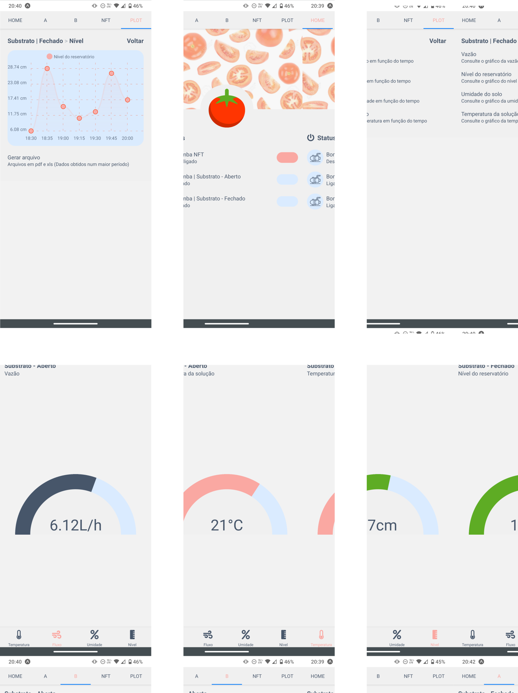

# Rodando o projeto :open_file_folder:
O projeto faz uso da abstração Expo. Para rodá-lo no seu dispositivo é preciso ter o `expo-cli` disponível. Porém, como ele depende de algum gerenciador de pacotes como o `npm` (node package manager), vamos à instalação deste.
<p align="center">
    
</p>

## Instalando o npm :package:
Se a sua máquina apresentar o NodeJS o npm estará disponível como consequência, se não faça o download nesse [link](https://nodejs.org/en/) (Recomenda-se a versão LTS - long-term support).
## Instalando o expo-cli :desktop_computer:
Acesse o prompt de comando e navegue até o diretório onde o projeto será alocado. No Windows, o terminal geralmente aparece da seguinte forma ao ser aberto
```
Microsoft Windows [versão 10.0.19041.630]
(c) 2020 Microsoft Corporation. Todos os direitos reservados.

C:\Users\user>
```
copie a linha abaixo
```
$ cd Desktop & md mobile-app & cd mobile-app
```
e dê `<enter>` para acessar o diretório atribuído como `mobile-app`. Algo semelhante a isso deve aparecer
```
Microsoft Windows [versão 10.0.19041.630]
(c) 2020 Microsoft Corporation. Todos os direitos reservados.

C:\Users\user>cd Desktop & md mobile-app & cd mobile-app
C:\Users\user\Desktop\mobile-app>
```
Rode o comando abaixo para instalar o `expo-cli` globalmente
```
$ npm i -g expo-cli
```
Caso o `git` não estiver instalado é preferível que seja feito o download do arquivo zip e sua extração no diretório de `mobile-app`. É provável que ao extrair o projeto outra pasta seja criada dentro do diretório de `mobile-app`, entretanto basta acessar a mesma via prompt e rodar as linhas para instalar as dependências do projeto e rodar o mesmo em seguida, respectivamente
```
$ npm install 
$ expo start
```
Em alguns instantes deve ser aberta uma aba no navegador com um QR code no canto inferior esquerdo. 
## App expo :iphone:
Nesse estágio é importante que o aplicativo móvel Expo esteja instalado. Dentro do app clique para escanear o código QR e aguarde até que o projeto seja renderizado.
<p align="center">
    
</p>